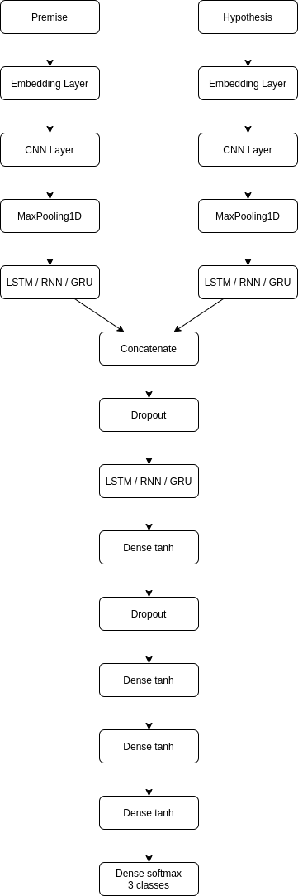

# Natural Language Inference in Bahasa Indonesia
Final project of Natural Language Processing course, June-July 2020.

Team Member:
- Muhamad Abdurahman
- Muhamad Achir Suci Ramadhan
- Sage Muhammad Abdullah

In this project, we were asked to do a full cycle work of an NLP topic, namely natural language inference (a.k.a. textual entailment) on texts in Bahasa Indonesia. The training sets consists of ~6000 rows of premise, hypothesis, and label (entailment, contradiction, or neutral) that is generated via outsourcing from the students of this course.

After the outsourcing part, we were asked to create a model that classify each pair premise-hypothesis to the right corresponding label. We were using two approaches to do this:
1. **Machine Learning Model non-NN using extensive feature extraction**. This approach were done by extracting features from the texts: Levenshtein ratio/partial ratio/token sort ratio, number of stopwords that is deleted from the premis/hypothesis, number of positive/negative words in premis/hypothesis/intersection between both, BLEU score, ratio/total/difference of the-length/number-of-token in premis and hypothesis, Jaccard similarity, position of intersect between premis and hypothesis, etc. After that, we tried some machine learning classifier non-NN and choose the best one. This approach gives a much better result compared to our NN approach.
2. **Neural Network + Embedding Layer**. Our neural network is explained by the diagram below. We were experimenting using Embedding layer from Tensorflow and Word2vec, LSTM/RNN/GRU layer, and Dense layer. However, the result is very poor compared to the first approach.

